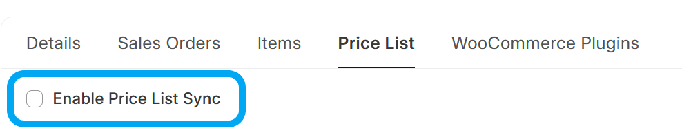

# Sync Item Prices from ERPNext to WooCommerce

## Overview

Price sync is **one-directional**: ERPNext → WooCommerce. Two price lists can be configured per WooCommerce Server:

- **Price List** — syncs to the WooCommerce *Regular Price* field
- **Sales Price List** — syncs to the WooCommerce *Sale Price* field (optional)

## Regular Price Sync

Enable *Price List Sync* on the **Price List** tab of **WooCommerce Server** and select a *Price List*. Prices from this list will be pushed to the `regular_price` field on each linked WooCommerce Product.

## Sale Price Sync

Enable *Sales Price List Sync* and select a *Sales Price List*. Prices from this list will be pushed to the `sale_price` field on each linked WooCommerce Product.

### Sale Validity Dates

If the **Item Price** record on the Sales Price List has *Valid From* and/or *Valid Upto* dates set, these are synced to WooCommerce as `date_on_sale_from` and `date_on_sale_to`:

| ERPNext Item Price field | WooCommerce Product field |
|--------------------------|---------------------------|
| `valid_from` | `date_on_sale_from` |
| `valid_upto` | `date_on_sale_to` |

WooCommerce uses these dates to automatically activate and deactivate the sale price display on the storefront — no manual intervention required.

**Notes:**
- If neither date is set the sale runs indefinitely (WooCommerce auto-sets `date_on_sale_from` to the current timestamp).
- If `valid_upto` is in the past, WooCommerce receives the date and hides the sale price on the storefront automatically.
- If the Item Price record is deleted entirely, the next sync run will clear `sale_price` on WooCommerce.

### Requirement

Sale price sync runs inside the regular price sync loop. An item must have a price record on the **Price List** (regular price) as well as on the **Sales Price List** for the sale price to be pushed. If only a sales price record exists the sync loop will not process that item.

## Background Job

If *Price List Sync* is enabled, every day, a background task runs that performs the following steps:
1. Get list of ERPNext Item Prices to synchronise, based on the *Price List* setting
2. If *Sales Price List Sync* is enabled, also fetch sale prices from the *Sales Price List*
3. Synchronise both regular and sale prices with WooCommerce Products in a single API call per product

## Disabled Items

A disabled **Item** is skipped by price synchronisation, so its **WooCommerce Product** keeps the price of its last synchronisation, and a sale that has since ended is never cleared.

Enable **WooCommerce Server** > *Price List* > *Sync Prices for Disabled Items* to keep synchronising their prices. Both the regular and the sale price list are included, so an **Item** disabled while on sale has that sale cleared as expected.

## Hooks

If *Price List Sync* is enabled, a product update API request will be made when the following documents are updated:
- Item Price (on either the regular Price List or the Sales Price List)

## Manual Trigger

Price List Synchronisation can also be triggered from an **Item**, by clicking on *Actions* > *Sync this Item's Price to WooCommerce*

## Troubleshooting
- You can look at the list of **WooCommerce Products** from within ERPNext by opening the **WooCommerce Product** doctype. This is a [Virtual DocType](https://frappeframework.com/docs/v15/user/en/basics/doctypes/virtual-doctype) that interacts directly with your WooCommerce site's API interface
- Any errors during this process can be found under **Error Log**.
- You can also check the **Scheduled Job Log** for the `sync_item_prices.run_item_price_sync` Scheduled Job.
- A history of all API calls made to your Wordpress Site can be found under **WooCommerce Request Log** (*Enable WooCommerce Request Logs* needs to be turned on on **WooCommerce Server** > *Logs*)
